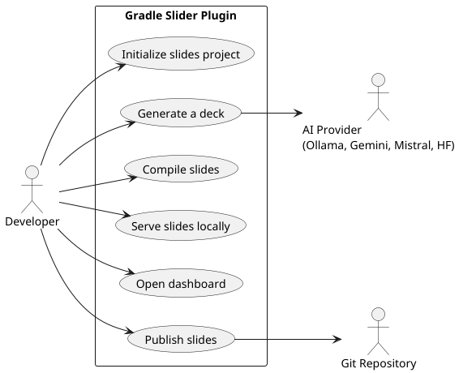
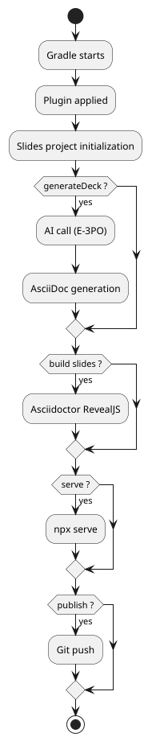
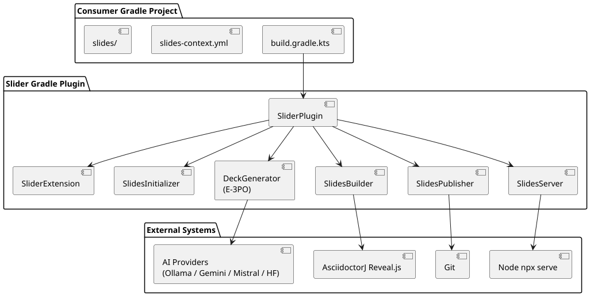
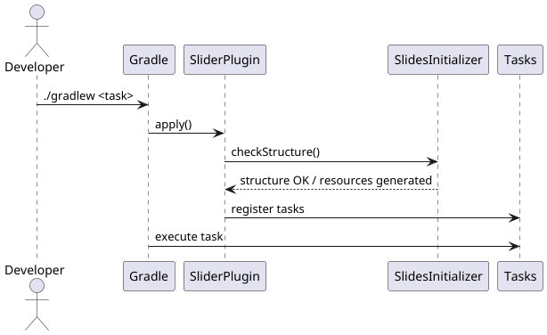
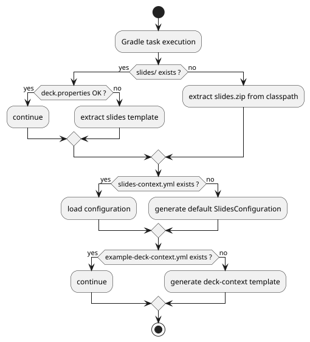
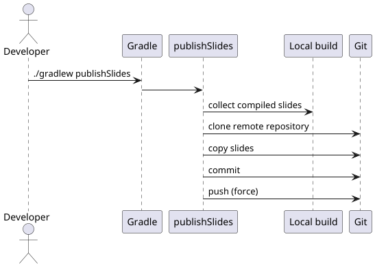
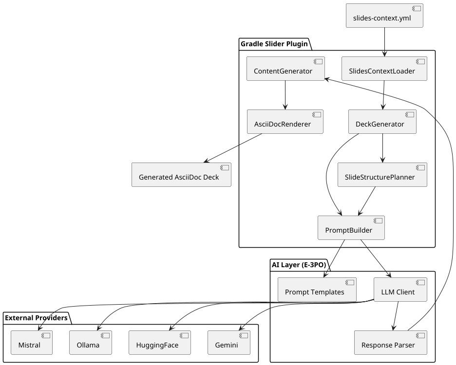
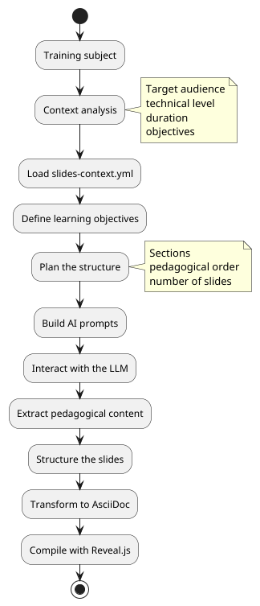
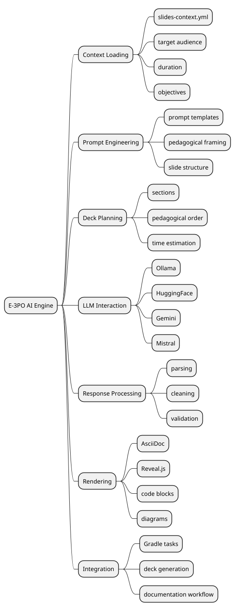
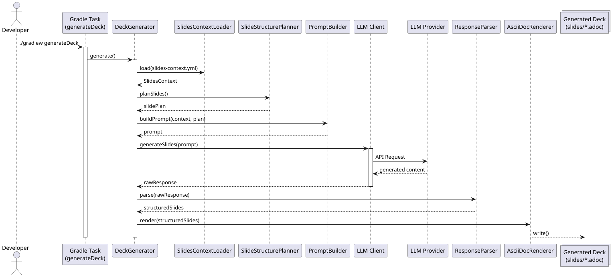

= Gradle Slider Project
:toc: left
:toclevels: 3
:source-highlighter: rouge
:icons: font
:lang: en
:hardbreaks-option:
:plugin-version: 0.0.4

++++

  

++++

image:https://img.shields.io/badge/Kotlin-2.x-7F52FF?logo=kotlin[Kotlin]
image:https://img.shields.io/badge/Gradle-9.x-02303A?logo=gradle[Gradle]
image:https://img.shields.io/badge/Java-25-ED8B00?logo=openjdk[Java]
image:https://img.shields.io/badge/License-Apache%202.0-blue.svg[License]

== Description
This project demonstrates the use of the **com.cheroliv.slider** plugin with **Gradle 9.4.0** and **Java 25** to create interactive presentations using *AsciidoctorJ Reveal.js*.

All slide generation logic is fully encapsulated in the `slider-plugin/`, keeping the consumer build script minimal.

=== Use Cases

=== Global Flow Overview

== Current version: {plugin-version}

== Prerequisites
* JDK 25 (tested with Eclipse Temurin 25.0.2), 23+ supported
* Gradle Wrapper (version 9.4.0 included)
* Node.js / npx (for the `serveSlides` task)
* Internet connection (to download Reveal.js dependencies)

== Minimal Consumer Configuration

=== settings.gradle.kts
[source,kotlin]
----
pluginManagement.repositories.gradlePluginPortal()

rootProject.name = "slider-gradle"
----

=== build.gradle.kts
[source,kotlin]
----
plugins { alias(libs.plugins.slider) }

slider { configPath = file("slides-context.yml").absolutePath }
----

=== gradle/libs.versions.toml
[source,toml,subs="attributes+"]
----
[versions]
slider = "{plugin-version}"

[plugins]
slider = { id = "com.cheroliv.slider", version.ref = "slider" }
----

== Project Structure

[source]
----
.
├── build.gradle.kts          # Main Gradle configuration (consumer)
├── settings.gradle.kts       # pluginManagement configuration
├── gradle/
│   ├── libs.versions.toml    # Dependency catalog
│   └── wrapper/              # Gradle Wrapper 9.4.0
├── slides/
│   └── misc/                 # AsciiDoc presentation sources
│       ├── *.adoc            # Slide source files
│       ├── *-deck-context.yml# AI generation context per deck
│       ├── index.html        # Presentation dashboard
│       ├── deck.properties   # Deck file paths
│       └── images/           # Image resources
├── slides-context.yml        # Git push config + AI API keys
├── slider-plugin/            # Gradle plugin (plugin source)
├── README.adoc               # This file
└── README_fr.adoc            # French version
----

=== Global Architecture

=== Gradle Execution Cycle

== Automatic Initialization (first use)

On the first execution of any Gradle task, the plugin checks whether the `slides/` folder,
the `slides-context.yml` file and `slides/misc/example-deck-context.yml` are present and complete.

=== Initializing slides/

A `slides/` folder is considered **complete** if `slides/misc/` contains:

* `deck.properties` — deck configuration file (keys `*.deck.file`)
* `index.html` — presentation dashboard
* at least one `*-deck.adoc` file referenced by a `*.deck.file` key in `deck.properties`

If any of these conditions is not met, the plugin automatically extracts a default `slides/`
folder from the zip bundled in its classpath.

=== deck.properties Convention

[source,properties]
----
# Each key follows the *.deck.file pattern
# The value is the name of the generated HTML file (*-deck.html)
# The corresponding AsciiDoc source file is *-deck.adoc

example.deck.file=example-deck.html
default.deck.file=default-deck.html
asciidoc.capsule.deck.file=asciidoc.capsule-deck.html
----

The source file `example-deck.adoc` must exist in `slides/misc/` for the configuration to be considered valid.

=== Initializing slides-context.yml

If `slides-context.yml` is missing, the plugin automatically generates one from the
typed `SlidesConfiguration` model. This file contains the Git push configuration and
AI provider API keys:

[source,yaml]
----
srcPath: docs/asciidocRevealJs
pushSlides:
  from: build/docs/asciidocRevealJs
  to: build/slides-repo
  branch: main
  message: deploy slides
  repo:
    name: slides
    repository: https://github.com/your-org/your-slides-repo.git
    credentials:
      username: your-username
      password: your-token
ai:
  gemini:
    - your-gemini-api-key
  mistral:
    - your-mistral-api-key
  huggingface:
    - your-huggingface-api-key
----

NOTE: `slides-context.yml` contains sensitive credentials — add it to `.gitignore`.

=== Initializing example-deck-context.yml

If `slides/misc/example-deck-context.yml` is missing, the plugin generates a ready-to-use
template for the `generateDeck` task:

[source,yaml]
----
subject: "Your presentation subject"
audience: "Your target audience"
duration: 45
language: "English"
outputFile: "example-deck.adoc"
author:
  name: "Your Name"
  email: "your.email@example.com"
revealjs:
  theme: "sky"
  slideNumber: "c/t"
  width: 1408
  height: 792
notes:
  speakerNotes: true
  pageNotes: true
  pageNotesStyle: "DETAILED"
slides:
  - title: "Agenda"
    speakerHint: "Present the outline in 2 minutes, ask what the audience already knows."
    pageNotesHint: "List prerequisites and suggested readings."
----

NOTE: If all three resources already exist, the plugin never touches the existing content.

== Plugin DSL Configuration

[source,kotlin]
----
slider {
    // Path to the YAML configuration file (required)
    configPath = file("slides-context.yml").absolutePath
}
----

== Slider Tasks

=== Build

`asciidoctorRevealJs`::
Compiles `.adoc` sources into an HTML Reveal.js presentation.
Slides are generated in `build/docs/asciidocRevealJs/`.

[source,bash]
----
./gradlew asciidoctorRevealJs
----

`asciidoctor`::
Runs the standard Asciidoctor conversion (depends on `asciidoctorRevealJs`).

`cleanSlidesBuild`::
Deletes the generated presentation artefacts from the `build` directory.

[source,bash]
----
./gradlew cleanSlidesBuild
----

`dashSlidesBuild`::
Generates the `index.html` and `slides.json` files listing all available presentations.

=== Serve

`serveSlides`::
Serves the slides via the *serve* package run by **npx**.
Ideal for a quick local preview.

[source,bash]
----
./gradlew serveSlides
----

=== Open

`openChromium`::
Opens the default presentation file in **Chromium**.

`openFirefox`::
Opens the presentation dashboard in **Firefox**.

=== Deploy

`publishSlides`::
Deploys the generated slides to the remote repository configured in `slides-context.yml`.

[source,bash]
----
./gradlew publishSlides
----

==== Deployment Pipeline

== AI-Assisted Deck Generation (slider-ai)

The plugin integrates an AI assistant (E-3PO) that generates complete AsciiDoc/Reveal.js
decks from a YAML context file. Four providers are supported: `ollama` (default),
`gemini`, `mistral` and `huggingface`. The provider is selected at the command line with `-Pai.provider`.

=== AI Engine Architecture (E-3PO)

The E-3PO engine transforms a pedagogical configuration file into an AsciiDoc deck ready
to be compiled with Reveal.js. It is designed to be modular, provider-agnostic and extensible.

=== Pedagogical Pipeline (Instructional Design → Slides)

The engine follows a transformation pipeline inspired by instructional design practices.

=== Internal Responsibilities (E-3PO)

=== generateDeck

Reads a `*-deck-context.yml` file and generates a complete `.adoc` deck via the configured LLM.

[source,bash]
----
# Default provider: ollama (local)
./gradlew generateDeck -Pdeck.context=slides/misc/my-deck-context.yml

# Gemini
./gradlew generateDeck -Pdeck.context=slides/misc/my-deck-context.yml -Pai.provider=gemini

# Mistral AI
./gradlew generateDeck -Pdeck.context=slides/misc/my-deck-context.yml -Pai.provider=mistral

# HuggingFace (via OpenAI-compatible router)
./gradlew generateDeck -Pdeck.context=slides/misc/my-deck-context.yml -Pai.provider=huggingface
----

The output file is written to `slides/misc/` at the path defined by `outputFile` in the context.

==== Full Generation Sequence

=== Provider Selection

[cols="1,2,2"]
|===
| `-Pai.provider` | Default model | API key in slides-context.yml

| `ollama` _(default)_
| `smollm:135m` (local)
| _none — local inference_

| `gemini`
| `gemini-2.5-flash`
| `ai.gemini[0]`

| `mistral`
| `mistral-small-latest`
| `ai.mistral[0]`

| `huggingface`
| `Llama-3.1-8B-Instruct:sambanova`
| `ai.huggingface[0]`
|===

If `-Pai.provider` is absent or set to an unknown value, the task falls back to `ollama` and logs a warning.

=== deck-context.yml Format

[source,yaml]
----
subject: "Introduction to Kotlin"
audience: "senior Java developers"
duration: 60
language: "English"
outputFile: "kotlin-intro-deck.adoc"
author:
  name: "cheroliv"
  email: "cheroliv.developer@gmail.com"
revealjs:
  theme: "sky"
  slideNumber: "c/t"
  width: 1408
  height: 792
notes:
  speakerNotes: true    # generates [NOTE.speaker] on every slide
  pageNotes: true       # generates [.notes] on every slide
  pageNotesStyle: "DETAILED"  # MINIMAL | DETAILED | EXERCISES_ONLY
slides:
  - title: "Why Kotlin?"
    speakerHint: "Start from daily Java pain points: boilerplate, NPE, verbosity."
    pageNotesHint: "Include JetBrains Kotlin adoption statistics 2023."
  - title: "Null Safety"
    speakerHint: "Show a Java NPE then the same logic in Kotlin."
    pageNotesHint: "Exercise: migrate a nullable Java POJO to a Kotlin data class."
----

`slides` is optional — if empty, the LLM decides the slide structure freely.

=== Notes Styles

[cols="1,2"]
|===
| Style | Content generated in [.notes]

| `MINIMAL`
| One reference line only

| `DETAILED`
| Deep content + references + exercises

| `EXERCISES_ONLY`
| Practical exercises only
|===

=== Typical Workflows

.Build and preview locally
[source,bash]
----
./gradlew serveSlides
----

.Clean and rebuild
[source,bash]
----
./gradlew cleanSlidesBuild asciidoctorRevealJs
----

.Generate deck + compile + serve in one command
[source,bash]
----
./gradlew generateDeck asciidoctorRevealJs serveSlides \
  -Pdeck.context=slides/misc/kotlin-intro-deck-context.yml \
  -Pai.provider=gemini
----

.Publish to remote repository
[source,bash]
----
./gradlew asciidoctorRevealJs publishSlides
----

== Advanced Architecture

=== C4 View — Plugin Context

The C4 model represents software architecture at multiple levels; here the complete system context.

[plantuml]
....
@startuml
actor Developer

rectangle "Developer Environment" {
  rectangle "Gradle Build System" {
    component "Slider Gradle Plugin"
  }
}

rectangle "Slider Internal Components" {
  component "Slides Initializer"
  component "Deck Generator"
  component "Slides Builder"
  component "Slides Publisher"
}

rectangle "AI Engine (E-3PO)" {
  component "Prompt Builder"
  component "LLM Client"
  component "Response Parser"
}

rectangle "External Systems" {
  component "LLM Providers\n(Ollama / Gemini / HF / Mistral)"
  component "Reveal.js / Asciidoctor"
  component "Git Repository"
}

Developer --> "Gradle Build System"
"Gradle Build System" --> "Slider Gradle Plugin"

"Slider Gradle Plugin" --> "Slides Initializer"
"Slider Gradle Plugin" --> "Deck Generator"
"Slider Gradle Plugin" --> "Slides Builder"
"Slider Gradle Plugin" --> "Slides Publisher"

"Deck Generator" --> "Prompt Builder"
"Prompt Builder" --> "LLM Client"
"LLM Client" --> "LLM Providers\n(Ollama / Gemini / HF / Mistral)"
"LLM Client" --> "Response Parser"
"Response Parser" --> "Deck Generator"

"Slides Builder" --> "Reveal.js / Asciidoctor"
"Slides Publisher" --> "Git Repository"
@enduml
....

=== Hexagonal Architecture (Ports & Adapters)

The plugin follows a hexagonal architecture that separates business logic,
external interfaces and infrastructure technologies.
This design guarantees LLM provider independence and high testability.

[plantuml]
....
@startuml
skinparam componentStyle rectangle

package "Domain Core" {
  component "Deck Generation Logic"
  component "Slides Structure"
  component "Presentation Context"
}

package "Application Layer" {
  component "DeckGenerator"
  component "SlidesInitializer"
  component "SlidesPublisher"
}

package "Ports" {
  interface "LLM Port"
  interface "Slides Renderer Port"
  interface "Git Repository Port"
}

package "Adapters" {
  component "Ollama Adapter"
  component "Gemini Adapter"
  component "Mistral Adapter"
  component "HuggingFace Adapter"
  component "RevealJS Adapter"
  component "Git Adapter"
  component "Gradle Task Adapter"
}

"DeckGenerator" --> "LLM Port"
"SlidesPublisher" --> "Git Repository Port"
"SlidesInitializer" --> "Slides Renderer Port"

"LLM Port" --> "Ollama Adapter"
"LLM Port" --> "Gemini Adapter"
"LLM Port" --> "Mistral Adapter"
"LLM Port" --> "HuggingFace Adapter"

"Slides Renderer Port" --> "RevealJS Adapter"
"Git Repository Port" --> "Git Adapter"

"Gradle Task Adapter" --> "DeckGenerator"
"Gradle Task Adapter" --> "SlidesInitializer"
"Gradle Task Adapter" --> "SlidesPublisher"
@enduml
....

This architecture delivers:

* independence from LLM providers
* ability to replace Reveal.js with another rendering engine
* high testability through dependency injection
* complete decoupling between Gradle and business logic

== Roadmap
* Configuration Cache support — blocked on `asciidoctor-gradle` `5.x` stable release.
* Automated functional tests for slide generation.
* Support for additional Reveal.js themes.
* Extended DSL configuration (theme, transition, source dir).

NOTE: The plugin explicitly declares `configurationCache = false` on the Gradle Plugin Portal.
Do not enable the Gradle Configuration Cache with this plugin — the `asciidoctorRevealJs` task
runs `OUT_OF_PROCESS` via JRuby and is not compatible in its current state.

== License
This project is licensed under Apache‑2.0 — see the `LICENSE` file.