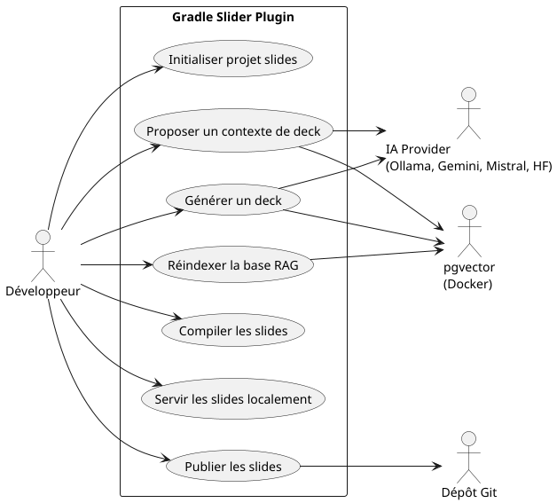
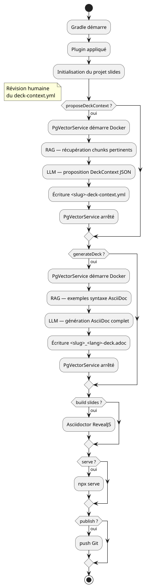
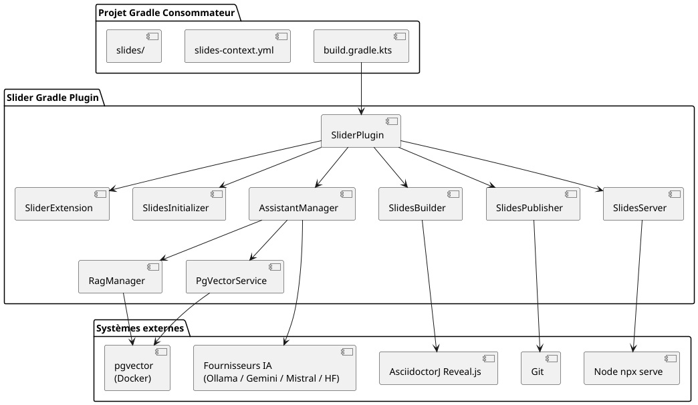
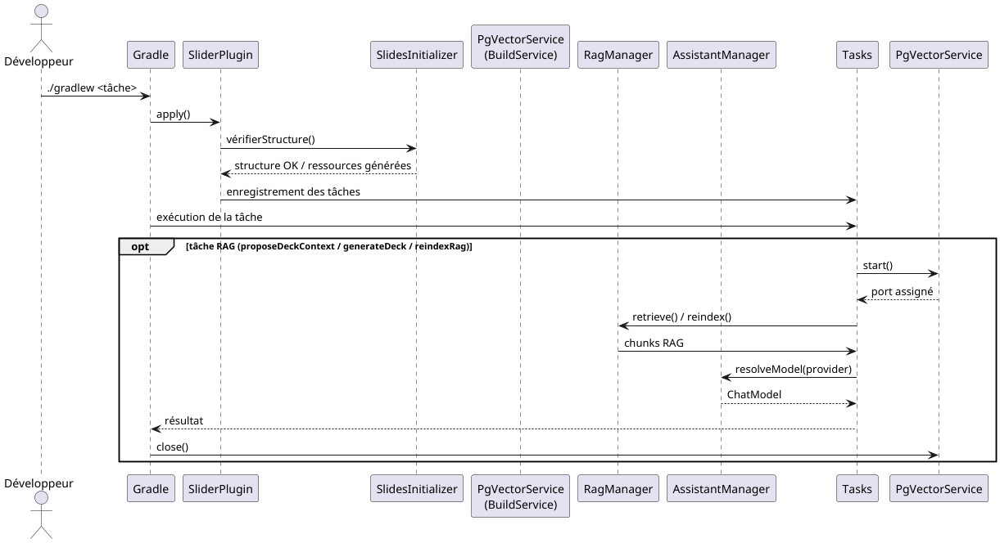
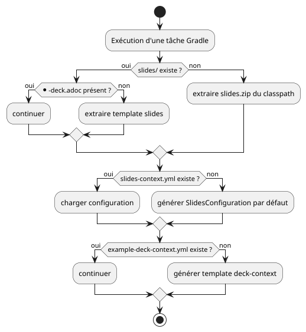
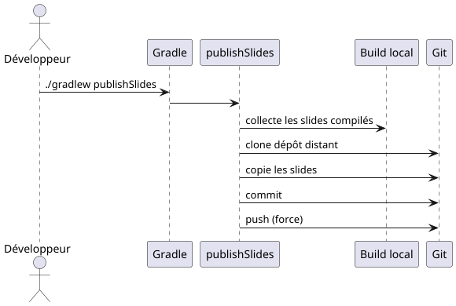
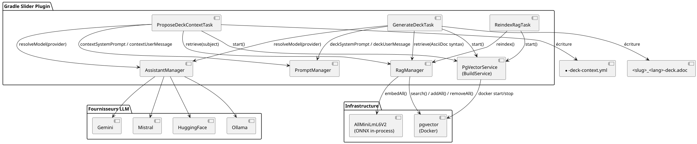
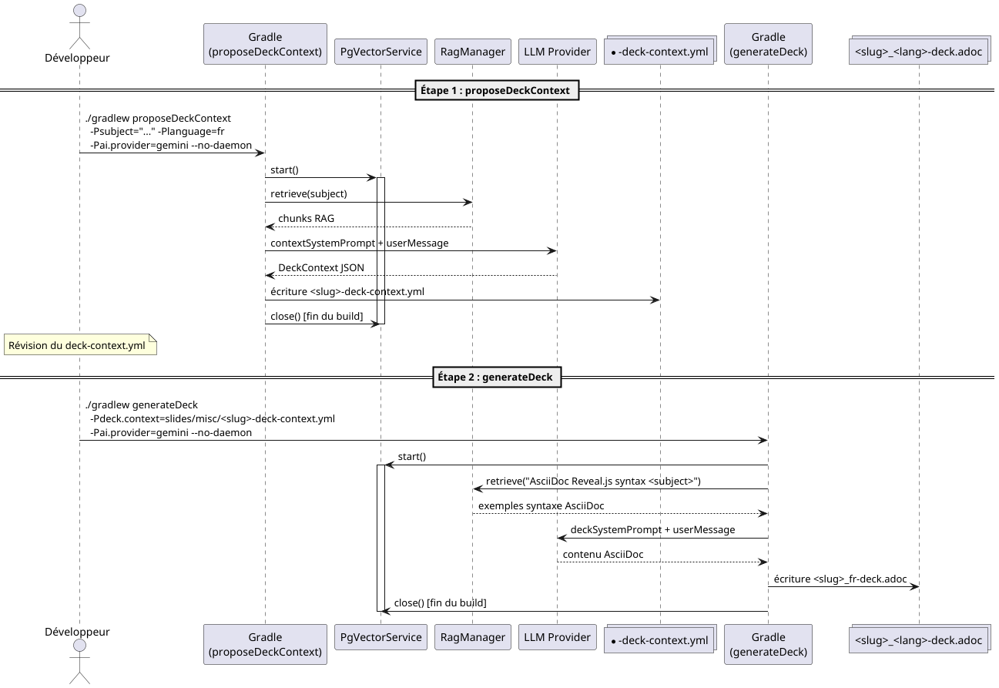
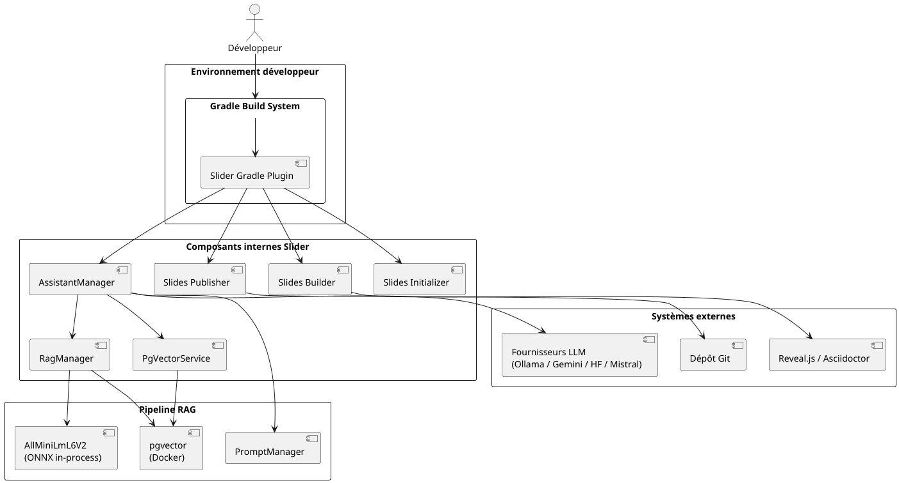
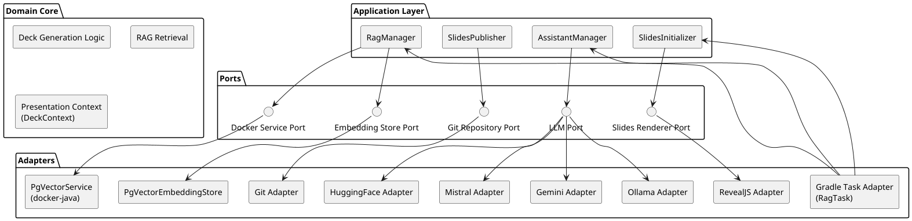

= Projet Gradle Slider
:toc: left
:toclevels: 3
:source-highlighter: rouge
:icons: font
:lang: fr
:hardbreaks-option:
:plugin-version: 0.0.5

++++

  

++++

image:https://img.shields.io/badge/Kotlin-2.x-7F52FF?logo=kotlin[Kotlin]
image:https://img.shields.io/badge/Gradle-9.x-02303A?logo=gradle[Gradle]
image:https://img.shields.io/badge/Java-25-ED8B00?logo=openjdk[Java]
image:https://img.shields.io/badge/License-Apache%202.0-blue.svg[License]

== Description
Ce projet illustre l'utilisation du plugin **com.cheroliv.slider** avec **Gradle 9.4.0** et **Java 25** pour créer des présentations interactives grâce à *AsciidoctorJ Reveal.js*.

La logique de génération des slides est entièrement encapsulée dans le plugin `slider-plugin/`, ce qui simplifie le script de build consommateur à l'essentiel.

La génération assistée par IA repose sur un pipeline RAG à deux étapes :
`proposeDeckContext` prépare un fichier de contexte pédagogique validé par l'auteur,
`generateDeck` produit le deck AsciiDoc final enrichi par les exemples du projet.

=== Cas d'usage

=== Vue d'ensemble du flux

== Version actuel : {plugin-version}

== Prérequis
* JDK 25 (testé avec Eclipse Temurin 25.0.2), support 23+
* Gradle Wrapper (version 9.4.0 incluse)
* Docker (pour le container pgvector utilisé par le pipeline RAG)
* Node.js / npx (pour la tâche `serveSlides`)
* Connexion Internet (pour télécharger les dépendances Reveal.js)

== Configuration minimale du consommateur

=== settings.gradle.kts
[source,kotlin]
----
pluginManagement.repositories.gradlePluginPortal()

rootProject.name = "slider-gradle"
----

=== build.gradle.kts
[source,kotlin]
----
plugins { alias(libs.plugins.slider) }

slider { configPath = file("slides-context.yml").absolutePath }
----

=== gradle/libs.versions.toml
[source,toml,subs="attributes+"]
----
[versions]
slider = "{plugin-version}"

[plugins]
slider = { id = "com.cheroliv.slider", version.ref = "slider" }
----

== Structure du projet

[source]
----
.
├── build.gradle.kts          # Configuration Gradle principale (consommateur)
├── settings.gradle.kts       # Configuration pluginManagement
├── gradle/
│   ├── libs.versions.toml    # Catalogue de dépendances
│   └── wrapper/              # Gradle Wrapper 9.4.0
├── slides/
│   └── misc/                 # Sources AsciiDoc des présentations
│       ├── *_<lang>-deck.adoc          # Decks générés (ex: kotlin-intro_fr-deck.adoc)
│       ├── *-deck-context.yml          # Contextes de génération IA (sans code langue)
│       ├── index.html                  # Dashboard des présentations
│       └── images/                     # Ressources images
├── slides-context.yml        # Configuration Git push + clés API IA
├── slider-plugin/            # Plugin Gradle (source du plugin)
├── README.adoc               # Version anglaise
└── README_fr.adoc            # Ce fichier
----

=== Architecture globale

=== Cycle d'exécution Gradle

== Initialisation automatique (première utilisation)

À la première exécution d'une tâche Gradle, le plugin vérifie si le dossier `slides/`,
le fichier `slides-context.yml` et `slides/misc/example-deck-context.yml` sont présents et complets.

=== Initialisation de slides/

Un dossier `slides/` est considéré **complet** s'il contient dans `slides/misc/` :

* `index.html` — dashboard des présentations
* au moins un fichier `*-deck.adoc`

Si l'une de ces conditions n'est pas remplie, le plugin extrait automatiquement un dossier `slides/`
par défaut depuis le zip embarqué dans son classpath.

NOTE: `deck.properties` a été supprimé — les decks sont découverts par scan direct des fichiers
`*-deck.adoc` dans `slides/misc/`, en accord avec la convention `<slug>_<lang>-deck.adoc`.

=== Initialisation de slides-context.yml

Si `slides-context.yml` est absent, le plugin en génère un automatiquement à partir du modèle
typé `SlidesConfiguration`. Ce fichier contient la configuration Git push et les clés API des
fournisseurs IA :

[source,yaml]
----
srcPath: "docs/asciidocRevealJs"
pushSlides:
  from: "docs/asciidocRevealJs"
  to: "cvs"
  branch: "slides"
  message: "slides show"
  repo:
    name: "your-project"
    repository: "https://github.com/your-org/your-project.git"
    credentials:
      username: "your-username"
      password: "your-github-token"
ai:
  gemini:
    - your-gemini-api-key
  mistral:
    - your-mistral-api-key
  huggingface:
    - your-huggingface-api-key
----

NOTE: `slides-context.yml` contient des credentials sensibles — ajoutez-le au `.gitignore`.

=== Initialisation de example-deck-context.yml

Si `slides/misc/example-deck-context.yml` est absent, le plugin génère un template prêt à l'emploi :

[source,yaml]
----
subject: "Your presentation subject"
audience: "Your target audience"
duration: 45
language: "fr"
outputFile: "example_fr-deck.adoc"
author:
  name: "Your Name"
  email: "your.email@example.com"
revealjs:
  theme: "sky"
  slideNumber: "c/t"
  width: 1408
  height: 792
notes:
  speakerNotes: true
  pageNotes: true
  pageNotesStyle: "DETAILED"
slides:
  - title: "Agenda"
    speakerHint: "Présente le plan en 2 minutes, demande ce que le public sait déjà."
    pageNotesHint: "Lister les prérequis et les lectures suggérées."
----

NOTE: Si les trois ressources existent déjà, le plugin ne touche jamais au contenu existant.

== Configuration DSL du plugin

[source,kotlin]
----
slider {
    // Chemin vers le fichier de configuration YAML (obligatoire)
    configPath = file("slides-context.yml").absolutePath
}
----

== Tâches Slider

=== Construction

`asciidoctorRevealJs`::
Compile les sources `.adoc` en une présentation HTML Reveal.js.
Les slides sont générés dans `build/docs/asciidocRevealJs/`.

[source,bash]
----
./gradlew asciidoctorRevealJs
----

`asciidoctor`::
Lance la conversion Asciidoctor standard (dépend de `asciidoctorRevealJs`).

`cleanSlidesBuild`::
Supprime les artefacts de présentation générés dans le répertoire `build`.

[source,bash]
----
./gradlew cleanSlidesBuild
----

`dashSlidesBuild`::
Génère le fichier `index.html` et `slides.json` listant toutes les présentations disponibles.

=== Servir

`serveSlides`::
Sert les slides via le paquet *serve* exécuté par **npx**.
Idéal pour une prévisualisation locale rapide.

[source,bash]
----
./gradlew serveSlides
----

=== Capsule

`asciidocCapsule`::
_(TODO)_ — Génération de capsules vidéo à partir des slides. Affiche actuellement un message de placeholder dans les logs.

[source,bash]
----
./gradlew asciidocCapsule
----

=== Déployer

`publishSlides`::
Déploie les slides compilés vers la branche configurée dans `slides-context.yml` via un push force.
Configuré avec `branch: "slides"`, les slides sont publiés sur la branche `slides` du dépôt — compatible GitHub Pages.

[source,bash]
----
./gradlew publishSlides
----

NOTE: Activez GitHub Pages sur la branche `slides` dans *Settings → Pages* de votre dépôt.
L'URL de publication sera : `https://<organisation>.github.io/<repo>/`

==== Pipeline de déploiement

== Génération de deck assistée par IA (slider-ai)

Le plugin intègre un pipeline RAG (Retrieval-Augmented Generation) à deux étapes.
Un store pgvector lancé via Docker indexe les sources AsciiDoc du projet et enrichit
chaque appel LLM avec des exemples pertinents.

Quatre fournisseurs sont disponibles : `ollama` (défaut), `gemini`, `mistral` et `huggingface`.
Le fournisseur se sélectionne avec `-Pai.provider`.

=== Architecture du pipeline RAG

=== Pipeline de génération (deux étapes)

=== Tâches IA disponibles

==== reindexRag

Vide et reconstruit intégralement l'index pgvector à partir des sources du projet.
À lancer après ajout ou suppression de fichiers sources.

[source,bash]
----
./gradlew reindexRag --no-daemon
----

==== proposeDeckContext

Propose un fichier `*-deck-context.yml` pour un sujet donné, enrichi par le contexte RAG.
L'auteur est résolu automatiquement depuis `git config user.name` / `git config user.email`.

[source,bash]
----
# Fournisseur par défaut : ollama (local)
./gradlew proposeDeckContext \
  -Psubject="Kotlin Coroutines" \
  -Planguage=fr \
  --no-daemon

# Ollama (explicite)
./gradlew proposeDeckContext \
  -Psubject="Kotlin inline functions and reification" \
  -Planguage=fr \
  -Pai.provider=ollama \
  --no-daemon

# Surcharger l'auteur
./gradlew proposeDeckContext \
  -Psubject="Spring Boot 3" \
  -Planguage=en \
  -Pai.provider=ollama \
  -Pauthor.name="cheroliv" \
  -Pauthor.email="cheroliv@example.com" \
  --no-daemon
----

Le fichier de sortie est `slides/misc/<slug>-deck-context.yml`.
Révisez et ajustez ce fichier avant de lancer `generateDeck`.

==== generateDeck

Lit un fichier `*-deck-context.yml` validé et génère le deck AsciiDoc complet,
enrichi par des exemples de syntaxe AsciiDoc récupérés depuis le store RAG.

[source,bash]
----
# Ollama (explicite)
./gradlew generateDeck \
  -Pdeck.context=slides/misc/kotlin-inline-functions-and-reification-deck-context.yml \
  -Pai.provider=ollama \
  --no-daemon

# Ollama — autre deck
./gradlew generateDeck \
  -Pdeck.context=slides/misc/kotlin-coroutines-deck-context.yml \
  -Pai.provider=ollama \
  --no-daemon
----

Le fichier de sortie est `slides/misc/<slug>_<lang>-deck.adoc`
où `<lang>` est le code ISO 639-1 contenu dans le champ `language` du deck-context.yml.

NOTE: Utilisez toujours `--no-daemon` pour les tâches RAG. Le daemon Gradle réutilise le
process JVM entre les builds, ce qui empêche le rechargement des libs natives ONNX
(libtokenizers.so) et provoque une erreur `UnsatisfiedLinkError` au second build.

=== Convention de nommage des fichiers

[cols="1,2,2"]
|===
| Fichier | Pattern | Exemple

| Contexte de génération
| `<slug>-deck-context.yml`
| `kotlin-inline-functions-and-reification-deck-context.yml`

| Deck AsciiDoc généré
| `<slug>_<lang>-deck.adoc`
| `kotlin-inline-functions-and-reification_fr-deck.adoc`

| Deck HTML compilé
| `<slug>_<lang>-deck.html`
| `kotlin-inline-functions-and-reification_fr-deck.html`
|===

Le `<slug>` est dérivé du sujet en kebab-case (accents normalisés, caractères spéciaux remplacés par `-`).
La langue `<lang>` est le code ISO 639-1 passé via `-Planguage` (ex: `fr`, `en`, `de`).

=== Sélection du fournisseur

[cols="1,2,2"]
|===
| `-Pai.provider` | Modèle par défaut | Clé API dans slides-context.yml

| `ollama` _(défaut)_
| `smollm:135m` (local)
| _aucune — inférence locale_

| `gemini`
| `gemini-2.5-flash`
| `ai.gemini[0]`

| `mistral`
| `mistral-small-latest`
| `ai.mistral[0]`

| `huggingface`
| `Llama-3.1-8B-Instruct:sambanova`
| `ai.huggingface[0]`
|===

Si `-Pai.provider` est absent ou contient une valeur inconnue, la tâche bascule sur `ollama` et affiche un avertissement.

=== Format du deck-context.yml

[source,yaml]
----
subject: "Kotlin inline functions and reification"
audience: "développeurs Kotlin intermédiaires"
duration: 60
language: "fr"
outputFile: "kotlin-inline-functions-and-reification_fr-deck.adoc"
author:
  name: "cheroliv"
  email: "cheroliv@example.com"
revealjs:
  theme: "sky"
  slideNumber: "c/t"
  width: 1408
  height: 792
notes:
  speakerNotes: true    # génère [NOTE.speaker] sur chaque slide
  pageNotes: true       # génère [.notes] sur chaque slide
  pageNotesStyle: "DETAILED"  # MINIMAL | DETAILED | EXERCISES_ONLY
slides:
  - title: "Pourquoi inline ?"
    speakerHint: "Partir du coût des lambdas en JVM — allocation objet à chaque appel."
    pageNotesHint: "Benchmarks JMH : inline vs non-inline sur une collection de 100k éléments."
  - title: "reified : accéder au type à l'exécution"
    speakerHint: "Montrer l'erreur de type-erasure, puis la solution reified."
    pageNotesHint: "Exercice : ré-implémenter une version typée de Gson.fromJson() avec reified."
----

`slides` est optionnel — si vide, le LLM décide librement de la structure des slides.

=== Styles de notes

[cols="1,2"]
|===
| Style | Contenu généré dans [.notes]

| `MINIMAL`
| Une seule ligne de référence

| `DETAILED`
| Approfondissement + références + exercices

| `EXERCISES_ONLY`
| Exercices pratiques uniquement
|===

=== Enchaînements typiques

.Pipeline complet : proposer → réviser → générer → compiler → servir
[source,bash]
----
# Étape 1 — proposer le contexte
./gradlew proposeDeckContext \
  -Psubject="Kotlin inline functions and reification" \
  -Planguage=fr \
  -Pai.provider=ollama \
  --no-daemon

# → réviser slides/misc/kotlin-inline-functions-and-reification-deck-context.yml

# Étape 2 — générer le deck
./gradlew generateDeck \
  -Pdeck.context=slides/misc/kotlin-inline-functions-and-reification-deck-context.yml \
  -Pai.provider=ollama \
  --no-daemon

# Étape 3 — compiler et servir
./gradlew asciidoctorRevealJs serveSlides
----

.Construire et prévisualiser en local
[source,bash]
----
./gradlew serveSlides
----

.Nettoyer et reconstruire
[source,bash]
----
./gradlew cleanSlidesBuild asciidoctorRevealJs
----

.Publier vers le dépôt distant
[source,bash]
----
./gradlew asciidoctorRevealJs publishSlides
----

== Architecture avancée

=== Vue C4 — Contexte du plugin

=== Architecture hexagonale (Ports & Adapters)

Le plugin suit une architecture hexagonale permettant de séparer la logique métier,
les interfaces externes et les technologies d'infrastructure.
Cette conception garantit l'indépendance vis-à-vis des fournisseurs LLM et la testabilité.

Cette architecture apporte :

* indépendance vis-à-vis des fournisseurs LLM
* store RAG swappable (pgvector aujourd'hui, autre backend demain)
* possibilité de remplacer Reveal.js par un autre moteur de rendu
* testabilité élevée via injection de dépendances
* découplage complet entre Gradle et la logique métier

== Roadmap
* Support du Configuration Cache — bloqué sur la version stable d'asciidoctor-gradle `5.x`.
* Tests Cucumber pour la tâche `generateDeck`.
* Support de nouvelles thématiques Reveal.js.
* Configuration DSL étendue (thème, transition, source dir).
* Indexation incrémentale automatique lors de l'édition des sources.
* `asciidocCapsule` — génération de capsules vidéo depuis les slides.

NOTE: Le plugin déclare explicitement `configurationCache = false` sur le Gradle Plugin Portal.
N'activez pas le Configuration Cache Gradle avec ce plugin — la tâche `asciidoctorRevealJs`
tourne `OUT_OF_PROCESS` via JRuby et n'est pas compatible dans l'état actuel.

== Licence
Ce projet est sous licence Apache‑2.0 – voir le fichier `LICENCE`.