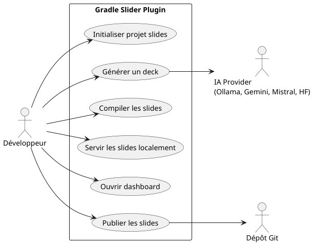
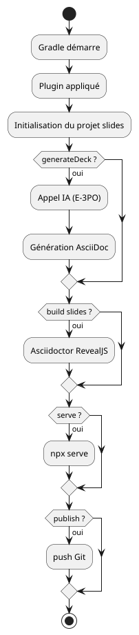
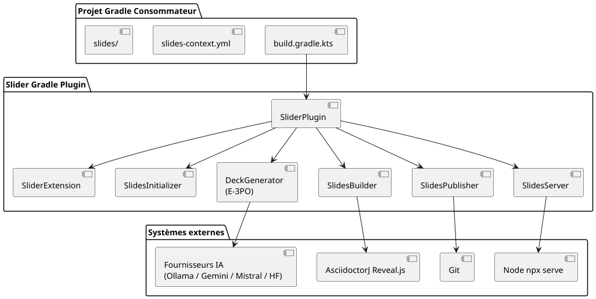

= Projet Gradle Slider
:toc: left
:toclevels: 3
:source-highlighter: rouge
:icons: font
:lang: fr
:hardbreaks-option:
:plugin-version: 0.0.4

++++

  

++++

image:https://img.shields.io/badge/Kotlin-2.x-7F52FF?logo=kotlin[Kotlin]
image:https://img.shields.io/badge/Gradle-9.x-02303A?logo=gradle[Gradle]
image:https://img.shields.io/badge/Java-25-ED8B00?logo=openjdk[Java]
image:https://img.shields.io/badge/License-Apache%202.0-blue.svg[License]

== Description
Ce projet illustre l'utilisation du plugin **com.cheroliv.slider** avec **Gradle 9.4.0** et **Java 25** pour créer des présentations interactives grâce à *AsciidoctorJ Reveal.js*.

La logique de génération des slides est entièrement encapsulée dans le plugin `slider-plugin/`, ce qui simplifie le script de build consommateur à l'essentiel.

=== Cas d'usage

=== Vue d'ensemble du flux

== Version actuel : {plugin-version}

== Prérequis
* JDK 25 (testé avec Eclipse Temurin 25.0.2), support 23+
* Gradle Wrapper (version 9.4.0 incluse)
* Node.js / npx (pour la tâche `serveSlides`)
* Connexion Internet (pour télécharger les dépendances Reveal.js)

== Configuration minimale du consommateur

=== settings.gradle.kts
[source,kotlin]
----
pluginManagement.repositories.gradlePluginPortal()

rootProject.name = "slider-gradle"
----

=== build.gradle.kts
[source,kotlin]
----
plugins { alias(libs.plugins.slider) }

slider { configPath = file("slides-context.yml").absolutePath }
----

=== gradle/libs.versions.toml
[source,toml,subs="attributes+"]
----
[versions]
slider = "{plugin-version}"

[plugins]
slider = { id = "com.cheroliv.slider", version.ref = "slider" }
----

== Structure du projet

[source]
----
.
├── build.gradle.kts          # Configuration Gradle principale (consommateur)
├── settings.gradle.kts       # Configuration pluginManagement
├── gradle/
│   ├── libs.versions.toml    # Catalogue de dépendances
│   └── wrapper/              # Gradle Wrapper 9.4.0
├── slides/
│   └── misc/                 # Sources AsciiDoc des présentations
│       ├── *.adoc            # Fichiers sources des slides
│       ├── *-deck-context.yml# Contexte de génération IA par deck
│       ├── index.html        # Dashboard des présentations
│       ├── deck.properties   # Chemins des decks à ouvrir
│       └── images/           # Ressources images
├── slides-context.yml        # Configuration Git push + clés API IA
├── slider-plugin/            # Plugin Gradle (source du plugin)
├── README.adoc               # Version anglaise
└── README_fr.adoc            # Ce fichier
----

=== Architecture globale

=== Cycle d'exécution Gradle

[plantuml]
....
@startuml
actor Développeur

participant "Gradle" as Gradle
participant "SliderPlugin"
participant "SlidesInitializer"
participant "Tasks"

Développeur -> Gradle : ./gradlew <tâche>
Gradle -> SliderPlugin : apply()
SliderPlugin -> SlidesInitializer : vérifierStructure()
SlidesInitializer --> SliderPlugin : structure OK / ressources générées
SliderPlugin -> Tasks : enregistrement des tâches
Gradle -> Tasks : exécution de la tâche
@enduml
....

== Initialisation automatique (première utilisation)

À la première exécution d'une tâche Gradle, le plugin vérifie si le dossier `slides/`,
le fichier `slides-context.yml` et `slides/misc/example-deck-context.yml` sont présents et complets.

[plantuml]
....
@startuml
start
:Exécution d'une tâche Gradle;

if (slides/ existe ?) then (oui)
  if (deck.properties OK ?) then (oui)
    :continuer;
  else (non)
    :extraire template slides;
  endif
else (non)
  :extraire slides.zip du classpath;
endif

if (slides-context.yml existe ?) then (oui)
  :charger configuration;
else (non)
  :générer SlidesConfiguration par défaut;
endif

if (example-deck-context.yml existe ?) then (oui)
  :continuer;
else (non)
  :générer template deck-context;
endif
stop
@enduml
....

=== Initialisation de slides/

Un dossier `slides/` est considéré **complet** s'il contient dans `slides/misc/` :

* `deck.properties` — fichier de configuration des decks (clés `*.deck.file`)
* `index.html` — dashboard des présentations
* au moins un fichier `*-deck.adoc` référencé par une clé `*.deck.file` dans `deck.properties`

Si l'une de ces conditions n'est pas remplie, le plugin extrait automatiquement un dossier `slides/`
par défaut depuis le zip embarqué dans son classpath.

=== Convention deck.properties

[source,properties]
----
# Chaque clé suit le pattern *.deck.file
# La valeur est le nom du fichier HTML généré (*-deck.html)
# Le fichier source AsciiDoc correspondant est *-deck.adoc

example.deck.file=example-deck.html
default.deck.file=default-deck.html
asciidoc.capsule.deck.file=asciidoc.capsule-deck.html
----

Le fichier source `example-deck.adoc` doit exister dans `slides/misc/` pour que la configuration soit considérée valide.

=== Initialisation de slides-context.yml

Si `slides-context.yml` est absent, le plugin en génère un automatiquement à partir du modèle
typé `SlidesConfiguration`. Ce fichier contient la configuration Git push et les clés API des
fournisseurs IA :

[source,yaml]
----
srcPath: docs/asciidocRevealJs
pushSlides:
  from: build/docs/asciidocRevealJs
  to: build/slides-repo
  branch: main
  message: deploy slides
  repo:
    name: slides
    repository: https://github.com/your-org/your-slides-repo.git
    credentials:
      username: your-username
      password: your-token
ai:
  gemini:
    - your-gemini-api-key
  mistral:
    - your-mistral-api-key
  huggingface:
    - your-huggingface-api-key
----

NOTE: `slides-context.yml` contient des credentials sensibles — ajoutez-le au `.gitignore`.

=== Initialisation de example-deck-context.yml

Si `slides/misc/example-deck-context.yml` est absent, le plugin génère un template prêt à l'emploi
pour la tâche `generateDeck` :

[source,yaml]
----
subject: "Your presentation subject"
audience: "Your target audience"
duration: 45
language: "French"
outputFile: "example-deck.adoc"
author:
  name: "Your Name"
  email: "your.email@example.com"
revealjs:
  theme: "sky"
  slideNumber: "c/t"
  width: 1408
  height: 792
notes:
  speakerNotes: true
  pageNotes: true
  pageNotesStyle: "DETAILED"
slides:
  - title: "Agenda"
    speakerHint: "Présente le plan en 2 minutes, demande ce que le public sait déjà."
    pageNotesHint: "Lister les prérequis et les lectures suggérées."
----

NOTE: Si les trois ressources existent déjà, le plugin ne touche jamais au contenu existant.

== Configuration DSL du plugin

[source,kotlin]
----
slider {
    // Chemin vers le fichier de configuration YAML (obligatoire)
    configPath = file("slides-context.yml").absolutePath
}
----

== Tâches Slider

=== Construction

`asciidoctorRevealJs`::
Compile les sources `.adoc` en une présentation HTML Reveal.js.
Les slides sont générés dans `build/docs/asciidocRevealJs/`.

[source,bash]
----
./gradlew asciidoctorRevealJs
----

`asciidoctor`::
Lance la conversion Asciidoctor standard (dépend de `asciidoctorRevealJs`).

`cleanSlidesBuild`::
Supprime les artefacts de présentation générés dans le répertoire `build`.

[source,bash]
----
./gradlew cleanSlidesBuild
----

`dashSlidesBuild`::
Génère le fichier `index.html` et `slides.json` listant toutes les présentations disponibles.

=== Servir

`serveSlides`::
Sert les slides via le paquet *serve* exécuté par **npx**.
Idéal pour une prévisualisation locale rapide.

[source,bash]
----
./gradlew serveSlides
----

=== Ouvrir

`openChromium`::
Ouvre le fichier de présentation par défaut dans **Chromium**.

`openFirefox`::
Ouvre le tableau de bord de la présentation dans **Firefox**.

=== Déployer

`publishSlides`::
Déploie les slides générés vers le dépôt distant configuré dans `slides-context.yml`.

[source,bash]
----
./gradlew publishSlides
----

==== Pipeline de déploiement

[plantuml]
....
@startuml
actor Développeur

participant Gradle
participant publishSlides
participant "Build local"
participant Git

Développeur -> Gradle : ./gradlew publishSlides
Gradle -> publishSlides
publishSlides -> "Build local" : collecte les slides compilés
publishSlides -> Git : clone dépôt distant
publishSlides -> Git : copie les slides
publishSlides -> Git : commit
publishSlides -> Git : push (force)
@enduml
....

== Génération de deck assistée par IA (slider-ai)

Le plugin intègre un assistant IA (E-3PO) qui génère des decks AsciiDoc/Reveal.js complets
à partir d'un fichier de contexte YAML. Quatre fournisseurs sont disponibles : `ollama` (défaut),
`gemini`, `mistral` et `huggingface`. Le fournisseur se sélectionne en ligne de commande avec `-Pai.provider`.

=== Architecture du moteur IA (E-3PO)

Le moteur E-3PO transforme un fichier de configuration pédagogique en deck AsciiDoc prêt à être
compilé avec Reveal.js. Il est conçu pour être modulaire, indépendant du fournisseur d'IA et extensible.

[plantuml]
....
@startuml
skinparam componentStyle uml2

package "Gradle Slider Plugin" {
  component "DeckGenerator" as Generator
  component "PromptBuilder" as PB
  component "SlidesContextLoader" as Loader
  component "SlideStructurePlanner" as Planner
  component "ContentGenerator" as CG
  component "AsciiDocRenderer" as Renderer
}

package "Couche IA (E-3PO)" {
  component "LLM Client" as Client
  component "Prompt Templates" as Templates
  component "Response Parser" as Parser
}

package "Fournisseurs externes" {
  component "Ollama"
  component "Mistral"
  component "Gemini"
  component "HuggingFace"
}

component "slides-context.yml" as Config
component "Deck AsciiDoc généré" as Output

Config --> Loader
Loader --> Generator
Generator --> PB
Generator --> Planner
Planner --> PB
PB --> Templates
PB --> Client
Client --> Ollama
Client --> Mistral
Client --> Gemini
Client --> HuggingFace
Client --> Parser
Parser --> CG
CG --> Renderer
Renderer --> Output
@enduml
....

=== Pipeline pédagogique (Instructional Design → Slides)

Le moteur suit un pipeline de transformation inspiré des pratiques d'ingénierie pédagogique.

[plantuml]
....
@startuml
start
:Sujet de formation;
:Analyse du contexte;
note right
  Public cible
  niveau technique
  durée
  objectifs
end note
:Chargement slides-context.yml;
:Définition des objectifs pédagogiques;
:Planification de la structure;
note right
  Sections
  ordre pédagogique
  nombre de slides
end note
:Construction des prompts IA;
:Interaction avec le LLM;
:Extraction du contenu pédagogique;
:Structuration des slides;
:Transformation en AsciiDoc;
:Compilation Reveal.js;
stop
@enduml
....

=== Responsabilités internes (E-3PO)

[plantuml]
....
@startmindmap
* E-3PO AI Engine

** Chargement du contexte
*** slides-context.yml
*** public cible
*** durée
*** objectifs

** Ingénierie des prompts
*** templates de prompt
*** cadrage pédagogique
*** structure des slides

** Planification du deck
*** sections
*** ordre pédagogique
*** estimation temporelle

** Interaction LLM
*** Ollama
*** HuggingFace
*** Gemini
*** Mistral

** Traitement des réponses
*** parsing
*** nettoyage
*** validation

** Rendu
*** AsciiDoc
*** Reveal.js
*** blocs de code
*** diagrammes

** Intégration
*** tâches Gradle
*** génération de deck
*** workflow documentaire
@endmindmap
....

=== generateDeck

Lit un fichier `*-deck-context.yml` et génère un deck `.adoc` complet via le LLM configuré.

[source,bash]
----
# Fournisseur par défaut : ollama (local)
./gradlew generateDeck -Pdeck.context=slides/misc/mon-deck-context.yml

# Gemini
./gradlew generateDeck -Pdeck.context=slides/misc/mon-deck-context.yml -Pai.provider=gemini

# Mistral AI
./gradlew generateDeck -Pdeck.context=slides/misc/mon-deck-context.yml -Pai.provider=mistral

# HuggingFace (via routeur OpenAI-compatible)
./gradlew generateDeck -Pdeck.context=slides/misc/mon-deck-context.yml -Pai.provider=huggingface
----

Le fichier de sortie est écrit dans `slides/misc/` au chemin défini par `outputFile` dans le contexte.

==== Séquence complète de génération

[plantuml]
....
@startuml
actor Développeur

participant "Gradle Task\n(generateDeck)" as GradleTask
participant "DeckGenerator"
participant "SlidesContextLoader"
participant "SlideStructurePlanner"
participant "PromptBuilder"
participant "LLM Client"
participant "LLM Provider"
participant "ResponseParser"
participant "AsciiDocRenderer"
collections "Deck généré\n(slides/*.adoc)" as Output

Développeur -> GradleTask : ./gradlew generateDeck

activate GradleTask
GradleTask -> DeckGenerator : generate()

activate DeckGenerator
DeckGenerator -> SlidesContextLoader : load(slides-context.yml)
SlidesContextLoader --> DeckGenerator : SlidesContext

DeckGenerator -> SlideStructurePlanner : planSlides()
SlideStructurePlanner --> DeckGenerator : slidePlan

DeckGenerator -> PromptBuilder : buildPrompt(context, plan)
PromptBuilder --> DeckGenerator : prompt

DeckGenerator -> "LLM Client" : generateSlides(prompt)
activate "LLM Client"
"LLM Client" -> "LLM Provider" : API Request
"LLM Provider" --> "LLM Client" : contenu généré
"LLM Client" --> DeckGenerator : rawResponse
deactivate "LLM Client"

DeckGenerator -> ResponseParser : parse(rawResponse)
ResponseParser --> DeckGenerator : structuredSlides

DeckGenerator -> AsciiDocRenderer : render(structuredSlides)
AsciiDocRenderer --> Output : write()
deactivate DeckGenerator
deactivate GradleTask
@enduml
....

=== Sélection du fournisseur

[cols="1,2,2"]
|===
| `-Pai.provider` | Modèle par défaut | Clé API dans slides-context.yml

| `ollama` _(défaut)_
| `smollm:135m` (local)
| _aucune — inférence locale_

| `gemini`
| `gemini-2.5-flash`
| `ai.gemini[0]`

| `mistral`
| `mistral-small-latest`
| `ai.mistral[0]`

| `huggingface`
| `Llama-3.1-8B-Instruct:sambanova`
| `ai.huggingface[0]`
|===

Si `-Pai.provider` est absent ou contient une valeur inconnue, la tâche bascule sur `ollama` et affiche un avertissement.

=== Format du deck-context.yml

[source,yaml]
----
subject: "Introduction à Kotlin"
audience: "développeurs Java seniors"
duration: 60
language: "French"
outputFile: "kotlin-intro-deck.adoc"
author:
  name: "cheroliv"
  email: "cheroliv.developer@gmail.com"
revealjs:
  theme: "sky"
  slideNumber: "c/t"
  width: 1408
  height: 792
notes:
  speakerNotes: true    # génère [NOTE.speaker] sur chaque slide
  pageNotes: true       # génère [.notes] sur chaque slide
  pageNotesStyle: "DETAILED"  # MINIMAL | DETAILED | EXERCISES_ONLY
slides:
  - title: "Pourquoi Kotlin ?"
    speakerHint: "Partir du ressenti quotidien Java : boilerplate, NPE, verbosité."
    pageNotesHint: "Inclure statistiques adoption Kotlin JetBrains 2023."
  - title: "Null Safety"
    speakerHint: "Montrer un NPE Java puis la même logique en Kotlin."
    pageNotesHint: "Exercice : migrer un POJO Java nullable en data class Kotlin."
----

`slides` est optionnel — si vide, le LLM décide librement de la structure des slides.

=== Styles de notes

[cols="1,2"]
|===
| Style | Contenu généré dans [.notes]

| `MINIMAL`
| Une seule ligne de référence

| `DETAILED`
| Approfondissement + références + exercices

| `EXERCISES_ONLY`
| Exercices pratiques uniquement
|===

=== Enchaînements typiques

.Construire et prévisualiser en local
[source,bash]
----
./gradlew serveSlides
----

.Nettoyer et reconstruire
[source,bash]
----
./gradlew cleanSlidesBuild asciidoctorRevealJs
----

.Générer deck + compiler + servir en une commande
[source,bash]
----
./gradlew generateDeck asciidoctorRevealJs serveSlides \
  -Pdeck.context=slides/misc/kotlin-intro-deck-context.yml \
  -Pai.provider=gemini
----

.Publier vers le dépôt distant
[source,bash]
----
./gradlew asciidoctorRevealJs publishSlides
----

== Architecture avancée

=== Vue C4 — Contexte du plugin

Le modèle C4 représente l'architecture logicielle à plusieurs niveaux, ici le contexte système complet.

[plantuml]
....
@startuml
actor Développeur

rectangle "Environnement développeur" {
  rectangle "Gradle Build System" {
    component "Slider Gradle Plugin"
  }
}

rectangle "Composants internes Slider" {
  component "Slides Initializer"
  component "Deck Generator"
  component "Slides Builder"
  component "Slides Publisher"
}

rectangle "Moteur IA (E-3PO)" {
  component "Prompt Builder"
  component "LLM Client"
  component "Response Parser"
}

rectangle "Systèmes externes" {
  component "Fournisseurs LLM\n(Ollama / Gemini / HF / Mistral)"
  component "Reveal.js / Asciidoctor"
  component "Dépôt Git"
}

Développeur --> "Gradle Build System"
"Gradle Build System" --> "Slider Gradle Plugin"

"Slider Gradle Plugin" --> "Slides Initializer"
"Slider Gradle Plugin" --> "Deck Generator"
"Slider Gradle Plugin" --> "Slides Builder"
"Slider Gradle Plugin" --> "Slides Publisher"

"Deck Generator" --> "Prompt Builder"
"Prompt Builder" --> "LLM Client"
"LLM Client" --> "Fournisseurs LLM\n(Ollama / Gemini / HF / Mistral)"
"LLM Client" --> "Response Parser"
"Response Parser" --> "Deck Generator"

"Slides Builder" --> "Reveal.js / Asciidoctor"
"Slides Publisher" --> "Dépôt Git"
@enduml
....

=== Architecture hexagonale (Ports & Adapters)

Le plugin suit une architecture hexagonale permettant de séparer la logique métier,
les interfaces externes et les technologies d'infrastructure.
Cette conception garantit l'indépendance vis-à-vis des fournisseurs LLM et la testabilité.

[plantuml]
....
@startuml
skinparam componentStyle rectangle

package "Domain Core" {
  component "Deck Generation Logic"
  component "Slides Structure"
  component "Presentation Context"
}

package "Application Layer" {
  component "DeckGenerator"
  component "SlidesInitializer"
  component "SlidesPublisher"
}

package "Ports" {
  interface "LLM Port"
  interface "Slides Renderer Port"
  interface "Git Repository Port"
}

package "Adapters" {
  component "Ollama Adapter"
  component "Gemini Adapter"
  component "Mistral Adapter"
  component "HuggingFace Adapter"
  component "RevealJS Adapter"
  component "Git Adapter"
  component "Gradle Task Adapter"
}

"DeckGenerator" --> "LLM Port"
"SlidesPublisher" --> "Git Repository Port"
"SlidesInitializer" --> "Slides Renderer Port"

"LLM Port" --> "Ollama Adapter"
"LLM Port" --> "Gemini Adapter"
"LLM Port" --> "Mistral Adapter"
"LLM Port" --> "HuggingFace Adapter"

"Slides Renderer Port" --> "RevealJS Adapter"
"Git Repository Port" --> "Git Adapter"

"Gradle Task Adapter" --> "DeckGenerator"
"Gradle Task Adapter" --> "SlidesInitializer"
"Gradle Task Adapter" --> "SlidesPublisher"
@enduml
....

Cette architecture apporte :

* indépendance vis-à-vis des fournisseurs LLM
* possibilité de remplacer Reveal.js par un autre moteur de rendu
* testabilité élevée via injection de dépendances
* découplage complet entre Gradle et la logique métier

== Roadmap
* Support du Configuration Cache — bloqué sur la version stable d'asciidoctor-gradle `5.x`.
* Tests fonctionnels automatisés pour la génération des slides.
* Support de nouvelles thématiques Reveal.js.
* Configuration DSL étendue (thème, transition, source dir).

NOTE: Le plugin déclare explicitement `configurationCache = false` sur le Gradle Plugin Portal.
N'activez pas le Configuration Cache Gradle avec ce plugin — la tâche `asciidoctorRevealJs`
tourne `OUT_OF_PROCESS` via JRuby et n'est pas compatible dans l'état actuel.

== Licence
Ce projet est sous licence Apache‑2.0 – voir le fichier `LICENCE`.