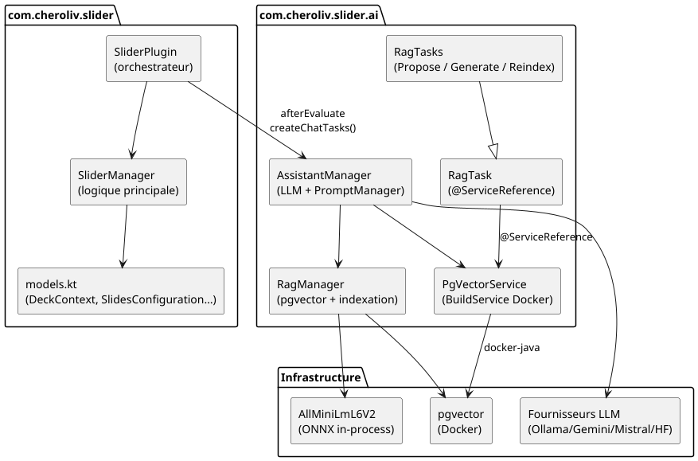
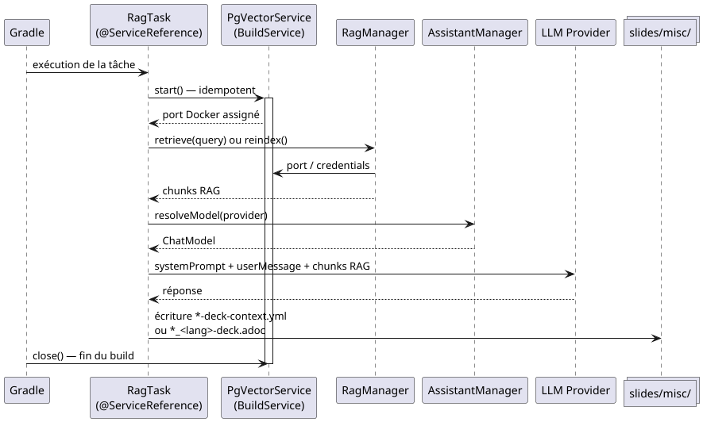

= Slider Plugin — Developer Guide
:toc: left
:toclevels: 3
:source-highlighter: rouge
:icons: font
:lang: en
:hardbreaks-option:
:plugin-version: 0.0.5

++++

  

++++

image:https://img.shields.io/badge/Kotlin-2.x-7F52FF?logo=kotlin[Kotlin]
image:https://img.shields.io/badge/Gradle-9.x-02303A?logo=gradle[Gradle]
image:https://img.shields.io/badge/Java-25-ED8B00?logo=openjdk[Java]
image:https://img.shields.io/badge/License-Apache%202.0-blue.svg[License]

== Description

`com.cheroliv.slider` is a Gradle plugin that encapsulates the full lifecycle of *AsciidoctorJ Reveal.js* slide generation.
It exposes a minimal DSL to the consumer and handles all repository, dependency, and task configuration internally.
It integrates a RAG (Retrieval-Augmented Generation) two-step pipeline for automated AsciiDoc/Reveal.js deck generation via multiple LLM providers.

== Current version: {plugin-version}

== Prerequisites

* JDK 25 (tested with Eclipse Temurin 25.0.2), 23+ supported
* Gradle 9.4.0+
* Docker (for the pgvector container used by the RAG pipeline)
* Node.js / npx (for the `serveSlides` task)

== Project Structure

[source]
----
slider-plugin/
├── slider/
│   ├── src/
│   │   ├── main/kotlin/com/cheroliv/slider/
│   │   │   ├── SliderPlugin.kt         # Plugin entry point — thin orchestrator
│   │   │   ├── SliderManager.kt        # All plugin logic — nested objects
│   │   │   └── models.kt               # Data models (DeckContext, SlidesConfiguration, Git…)
│   │   ├── main/kotlin/com/cheroliv/slider/ai/
│   │   │   ├── AssistantManager.kt     # LLM providers + PromptManager
│   │   │   ├── RagManager.kt           # pgvector store + incremental indexing
│   │   │   ├── PgVectorService.kt      # Gradle BuildService — Docker lifecycle
│   │   │   ├── RagTask.kt              # Abstract base class for RAG tasks
│   │   │   └── RagTasks.kt             # ReindexRagTask, ProposeDeckContextTask, GenerateDeckTask
│   │   ├── test/kotlin/                # Unit + Cucumber tests
│   │   └── functionalTest/kotlin/      # GradleTestKit functional tests
│   └── build.gradle.kts                # Plugin build script
├── gradle/
│   ├── libs.versions.toml              # Dependency catalogue
│   └── wrapper/                        # Gradle Wrapper
├── settings.gradle.kts
├── README.adoc                          # This file
└── README_fr.adoc                       # French version
----

=== Internal Architecture

== Key Technical Decisions

=== Plugin IDs — `.classic` suffix
Since `asciidoctor-gradle-jvm-slides:5.0.0-alpha.1`, the plugin IDs have changed:

[cols="1,1"]
|===
| Previous (4.x) | Current (5.x)

| `org.asciidoctor.jvm.gems`
| `org.asciidoctor.jvm.gems.classic`

| `org.asciidoctor.jvm.revealjs`
| `org.asciidoctor.jvm.revealjs.classic`
|===

=== Execution Mode — `OUT_OF_PROCESS`
`JAVA_EXEC` was removed in `5.0.0-alpha.1` due to Gradle API changes around closure serialisation.
`OUT_OF_PROCESS` is the correct replacement and works on Gradle 9 + Java 25.

=== pluginManagement repository — `repo.gradle.org`
The transitive dependency `grolifant:0.12` (required by `jruby-gradle-core-plugin`) is only available at:

[source]
----
https://repo.gradle.org/gradle/libs-releases/
----
This must be declared in the consumer's `pluginManagement.repositories`.

=== Ivy repository for Ruby gems
The gem `asciidoctor-revealjs` is resolved via a dedicated Ivy repository:
[source,kotlin]
----
project.repositories.ivy { repo ->
    repo.url = project.uri("https://rubygems.org/gems/")
    repo.patternLayout { layout -> layout.artifact("[module]-[revision].gem") }
    repo.metadataSources { s -> s.artifact() }
    repo.content { c -> c.includeGroup("rubygems") }
}
----
The `@gem` qualifier is mandatory:
[source,kotlin]
----
project.dependencies.add("asciidoctorGems", "rubygems:asciidoctor-revealjs:3.1.0@gem")
----

=== PgVectorService — Gradle BuildService + docker-java

The pgvector container is managed by `PgVectorService`, a build-scoped Gradle `BuildService`.
It is started explicitly via `start()` from within the task action, never during the configuration phase.

RAG tasks declare the dependency via `@ServiceReference` (Gradle 7.4+) — the only annotation
that guarantees Gradle keeps the service alive for the full duration of the task.

[source,kotlin]
----
// RagTask.kt — @ServiceReference guarantees lifecycle
abstract class RagTask : DefaultTask() {
    @get:ServiceReference
    abstract val pgVectorService: Property<PgVectorService>

    protected fun service(): PgVectorService =
        pgVectorService.get().also { it.start() }
}
----

The host port is assigned dynamically (binding `0:5432`) to avoid collision with any existing PostgreSQL.
The service is stopped automatically by Gradle at the end of the build.

=== SSL pgvector — `sslmode=disable`

The PostgreSQL JDBC driver attempts SSL negotiation by default, causing an `EOFException`
against a plain Docker container with no SSL configured. `RagManager.buildStore()` creates
a `PGSimpleDataSource` with `setSsl(false)` / `setSslMode("disable")` (inherited from
`BaseDataSource`) and injects it via the protected constructor of `PgVectorEmbeddingStore`.

=== `--no-daemon` required for RAG tasks

The Gradle daemon reuses the JVM process between builds, preventing native ONNX library
reload (`libtokenizers.so`) and causing `UnsatisfiedLinkError` on the second build.
All RAG tasks must be run with `--no-daemon`, or the project should declare
`org.gradle.daemon=false` in `gradle.properties`.

=== Scaffold — `deck.properties` removed

`deck.properties` has been removed. The `slides/` completeness check now scans for
`*-deck.adoc` files directly in `slides/misc/`. The `isSlidesConfigComplete` function
is a pure Kotlin function testable without GradleTestKit.

[source,kotlin]
----
private fun isSlidesConfigComplete(miscDir: File): Boolean {
    if (!miscDir.resolve("index.html").exists()) return false
    return miscDir.listFiles { f ->
        f.isFile && f.name.endsWith("-deck.adoc")
    }?.isNotEmpty() ?: false
}
----

=== `publishSlides` — configurable branch

The hardcoded `setInitialBranch("main")` bug in `pushSlide` has been fixed.
The publish branch is now read from `conf.pushSlides?.branch`:

[source,kotlin]
----
FileRepositoryBuilder()
    .setInitialBranch(conf.pushSlides?.branch ?: "main")
----

To publish to a `slides` branch of the same source repository and expose it via GitHub Pages:

[source,yaml]
----
pushSlides:
  from: "docs/asciidocRevealJs"
  to: "cvs"
  branch: "slides"
  message: "slides show"
  repo:
    repository: "https://github.com/your-org/your-project.git"
    credentials:
      username: "your-username"
      password: "your-github-token"
----

NOTE: Enable GitHub Pages on the `slides` branch in *Settings → Pages* of the repository.

=== Deck file naming convention

[cols="1,2,2"]
|===
| File | Pattern | Example

| Generation context
| `<slug>-deck-context.yml`
| `kotlin-coroutines-deck-context.yml`

| Generated AsciiDoc deck
| `<slug>_<lang>-deck.adoc`
| `kotlin-coroutines_fr-deck.adoc`
|===

The language in `outputFile` is the ISO 639-1 code from the `language` field of `DeckContext`.

== SliderPlugin.apply() — Orchestration

[source,kotlin]
----
override fun apply(project: Project) {
    with(project) {
        checkJavaVersion()
        scaffoldSlidesIfAbsent()
        scaffoldSlidesContextIfAbsent()
        scaffoldDeckContextIfAbsent()
        configureRepositories()
        applyPlugins()
        configureDependencies()
        configureExtensions()
        registerTasks()
        afterEvaluate { createChatTasks() }  // registers all AI tasks
    }
}
----

`createChatTasks()` is defined in `AssistantManager` and registers:
- `PgVectorService` via `gradle.sharedServices.registerIfAbsent()`
- `reindexRag`, `proposeDeckContext`, `generateDeck` (typed RAG tasks)
- smoke-test tasks `helloOllama*`, `helloGemini*`, `helloMistral*`, `helloHuggingFace*`

== Data Model

=== SlidesConfiguration

[source,kotlin]
----
data class AiConfiguration(
    val gemini: List<String> = emptyList(),
    val mistral: List<String> = emptyList(),
    val huggingface: List<String> = emptyList(),
)

data class SlidesConfiguration(
    val srcPath: String? = null,
    val pushSlides: GitPushConfiguration? = null,
    val ai: AiConfiguration? = null,
)
----

=== DeckContext

[source,kotlin]
----
enum class PageNotesStyle { MINIMAL, DETAILED, EXERCISES_ONLY }

data class NotesConfiguration(
    val speakerNotes: Boolean = true,  // generates [NOTE.speaker] on every slide
    val pageNotes: Boolean = true,     // generates [.notes] on every slide
    val pageNotesStyle: PageNotesStyle = PageNotesStyle.DETAILED,
)

data class SlideHint(
    val title: String,
    val speakerHint: String? = null,   // presenter tips — guides [NOTE.speaker] content
    val pageNotesHint: String? = null, // pedagogical intent — guides [.notes] content
)

data class DeckContext(
    val subject: String,
    val audience: String,
    val duration: Int,
    val language: String = "fr",      // ISO 639-1 code
    val outputFile: String,            // pattern: <slug>_<lang>-deck.adoc
    val author: AuthorContext,
    val revealjs: RevealJsContext = RevealJsContext(),
    val notes: NotesConfiguration = NotesConfiguration(),
    val slides: List<SlideHint> = emptyList(),
)
----

== Build & Publish

=== Publish to Maven Local (for local testing)

[source,bash]
----
./gradlew publishToMavenLocal
----

=== Run tests

[source,bash]
----
# Unit tests
./gradlew test

# Functional tests (GradleTestKit)
./gradlew functionalTest

# Cucumber BDD tests
./gradlew check
----

=== Publish to Gradle Plugin Portal

[source,bash]
----
./gradlew publishPlugins
----
Requires `gradle.publish.key` and `gradle.publish.secret` in `~/.gradle/gradle.properties`.

== Plugin DSL

[source,kotlin]
----
slider {
    // Path to the YAML configuration file (required)
    configPath = file("slides-context.yml").absolutePath
}
----

== Registered Tasks

[cols="1,1,2"]
|===
| Task | Group | Description

| `asciidoctorRevealJs`
| slider
| Compiles `.adoc` sources into a Reveal.js HTML presentation

| `asciidoctor`
| slider
| Standard Asciidoctor conversion (depends on `asciidoctorRevealJs`)

| `cleanSlidesBuild`
| slider
| Deletes generated presentation artefacts

| `dashSlidesBuild`
| documentation
| Generates `index.html` and `slides.json` dashboard

| `serveSlides`
| slider
| Serves slides via npx + serve package (prints link to console)

| `publishSlides`
| slider
| Deploys compiled slides to the configured branch (e.g. `slides`) via force push — compatible with GitHub Pages

| `asciidocCapsule`
| capsule
| _(TODO)_ Video capsule generation from slides

| `reindexRag`
| slider-ai
| Drops and fully rebuilds the pgvector embedding index

| `proposeDeckContext`
| slider-ai
| Proposes a `*-deck-context.yml` via RAG + LLM (step 1/2)

| `generateDeck`
| slider-ai
| Generates a complete AsciiDoc/Reveal.js deck from a `*-deck-context.yml` (step 2/2)

| `helloOllama*`
| slider-ai
| Ollama smoke tests (one per model in the catalogue)

| `helloGemini*`
| slider-ai
| Gemini smoke tests

| `helloMistral*`
| slider-ai
| Mistral AI smoke tests

| `helloHuggingFace*`
| slider-ai
| HuggingFace smoke tests

| `reportTests`
| verification
| Runs checks and opens test report in Firefox

| `reportFunctionalTests`
| verification
| Runs checks and opens functional test report in Firefox
|===

== AI Integration — RAG Pipeline

`AssistantManager.createChatTasks()` is called in `afterEvaluate` and registers all AI tasks.
The RAG pipeline relies on three components:

* `PgVectorService` — Gradle `BuildService` managing the Docker lifecycle via `docker-java`
* `RagManager` — incremental indexing by SHA-256, cosine-similarity search
* `AssistantManager` — model resolution, prompt construction, LLM call

=== RAG Pipeline Lifecycle

=== Supported providers

[cols="1,1,1"]
|===
| Provider | LangChain4j module | Key in slides-context.yml

| Ollama (local)
| `langchain4j-ollama`
| — (no key required)

| Google Gemini
| `langchain4j-google-ai-gemini`
| `ai.gemini[0]`

| Mistral AI
| `langchain4j-mistral-ai`
| `ai.mistral[0]`

| HuggingFace (via OpenAI router)
| `langchain4j-open-ai`
| `ai.huggingface[0]`
|===

=== RAG tasks — usage

[source,bash]
----
# Rebuild index (after adding/removing sources)
./gradlew reindexRag --no-daemon

# Propose a deck context (step 1/2)
./gradlew proposeDeckContext \
  -Psubject="Kotlin inline functions and reification" \
  -Planguage=fr \
  -Pai.provider=ollama \
  --no-daemon

# Generate the deck (step 2/2)
./gradlew generateDeck \
  -Pdeck.context=slides/misc/kotlin-inline-functions-and-reification-deck-context.yml \
  -Pai.provider=ollama \
  --no-daemon
----

Properties available for `proposeDeckContext`:

[cols="1,1,2"]
|===
| Property | Default | Description

| `-Psubject`
| _(required)_
| Presentation subject

| `-Planguage`
| `fr`
| ISO 639-1 code — determines `<lang>` in `outputFile`

| `-Pai.provider`
| `ollama`
| LLM provider

| `-Pauthor.name`
| `git config user.name`
| Author name (fallback: git config)

| `-Pauthor.email`
| `git config user.email`
| Author email (fallback: git config)

| `-Poutput`
| `slides/misc/<slug>-deck-context.yml`
| Custom output path
|===

=== Prompt strategy

`PromptManager` (inner object of `AssistantManager`) manages two prompts:

* `contextSystemPrompt` + `contextUserMessage` — step 1: proposes a `DeckContext` JSON
* `deckSystemPrompt` + `deckUserMessage` — step 2: generates the full AsciiDoc deck

Key rules enforced in `deckSystemPrompt`:

* Maximum 5 bullet points per slide with `[%step]`, 7 without
* Maximum 10 lines of code per `[source,...]` block
* Never combine a bullet list and a code block on the same slide
* `[NOTE.speaker]` and `[.notes]` presence controlled by `NotesConfiguration`
* `SlideHint` values guide content per slide without replacing LLM generation

=== Available models by provider

[cols="1,2"]
|===
| Provider | Models (catalogue)

| Ollama
| `smollm:135m`, `llama3.2:3b-instruct-q8_0`, `smollm:135m-instruct-v0.2-q8_0`, `gemma3:1b-it-fp16`

| Gemini
| `gemini-2.5-flash`

| Mistral
| `mistral-small-latest`, `open-mistral-nemo`

| HuggingFace
| `meta-llama/Llama-3.1-8B-Instruct:sambanova`, `Qwen/Qwen3.5-35B-A3B:novita`
|===

== Scaffold — Auto-Initialisation

=== `scaffoldSlidesIfAbsent()`

Checks whether the consumer project has a complete `slides/` directory. If not, extracts
the bundled `slides.zip` from the plugin classpath.

A `slides/` directory is considered complete when `slides/misc/` contains:

* `index.html` — presentation dashboard
* at least one `*-deck.adoc` source file

NOTE: `deck.properties` has been removed — decks are discovered by direct scan.

The bundled zip must be placed at `slider/src/main/resources/slides.zip`.
Zip entries must use relative paths starting with `slides/`:

[source]
----
slides/
└── misc/
    ├── example-deck.adoc
    └── index.html
----

=== `scaffoldSlidesContextIfAbsent()`

If `slides-context.yml` is absent, generates one automatically by serialising a default
`SlidesConfiguration` instance via `yamlMapper` — no hardcoded YAML strings.

=== `scaffoldDeckContextIfAbsent()`

If `slides/misc/example-deck-context.yml` is absent, generates a ready-to-use `DeckContext`
template via `yamlMapper`.

All three functions are no-ops if the resource already exists — existing consumer content is never overwritten.

== Dependencies

=== Key runtime dependencies

[cols="1,1"]
|===
| Dependency | Purpose

| `org.asciidoctor:asciidoctor-gradle-jvm-slides:5.0.0-alpha.1`
| Reveal.js slide generation

| `org.asciidoctor:asciidoctor-gradle-jvm-gems:5.0.0-alpha.1`
| JRuby gem management

| `com.github.node-gradle:gradle-node-plugin:7.1.0`
| Node.js / npx integration

| `org.eclipse.jgit`
| Git operations for slide publishing

| `com.fasterxml.jackson` (yaml + kotlin)
| YAML configuration parsing

| `io.arrow-kt:arrow-core`
| Functional programming utilities

| `dev.langchain4j:langchain4j-google-ai-gemini`
| Gemini LLM integration

| `dev.langchain4j:langchain4j-mistral-ai`
| Mistral AI integration

| `dev.langchain4j:langchain4j-open-ai`
| HuggingFace via OpenAI-compatible router

| `dev.langchain4j:langchain4j-ollama`
| Local Ollama models integration

| `dev.langchain4j:langchain4j-pgvector`
| pgvector embedding store

| `dev.langchain4j:langchain4j-embeddings-all-minilm-l6-v2`
| In-process ONNX embedding model (dim=384)

| `com.github.docker-java:docker-java-core`
| Docker management for PgVectorService

| `com.github.docker-java:docker-java-transport-httpclient5`
| HTTP transport for docker-java

| `org.postgresql:postgresql`
| PostgreSQL JDBC driver

| `org.jetbrains.kotlinx:kotlinx-coroutines-core`
| Async streaming response bridge
|===

== Consumer Requirements

The consumer configuration is minimal — the plugin handles all repository and dependency setup internally.

=== settings.gradle.kts
[source,kotlin]
----
pluginManagement.repositories {
    mavenLocal()
    gradlePluginPortal()
}
rootProject.name = "your-project-name"
----

=== build.gradle.kts
[source,kotlin]
----
plugins { alias(libs.plugins.slider) }

slider {
    configPath = "slides-context.yml"
        .run(::file)
        .absolutePath
}
----

=== gradle/libs.versions.toml
[source,toml,subs="attributes+"]
----
[versions]
slider = "{plugin-version}"

[plugins]
slider = { id = "com.cheroliv.slider", version.ref = "slider" }
----

=== gradle.properties (recommended)
[source,properties]
----
# Required for RAG tasks — prevents UnsatisfiedLinkError on libtokenizers.so
org.gradle.daemon=false
----

== Gradle Feature Compatibility

[source,kotlin]
----
gradlePlugin {
    plugins {
        create("slider") {
            compatibility {
                features {
                    // asciidoctorRevealJs runs OUT_OF_PROCESS via JRuby —
                    // not compatible with Configuration Cache.
                    configurationCache = false
                }
            }
        }
    }
}
----

Declaring `configurationCache = false` is honest and recommended — it informs users clearly
and has no negative consequences for the plugin's Portal ranking beyond the Configuration Cache badge.

== Roadmap
* Configuration Cache support — blocked on asciidoctor-gradle `5.x` stable release.
* Extended DSL — configurable theme, transition, source directory.
* Cucumber tests for the `generateDeck` task.
* `asciidocCapsule` — video capsule generation from slides.

== License
This project is licensed under the Apache 2.0 License – see the `LICENCE` file.